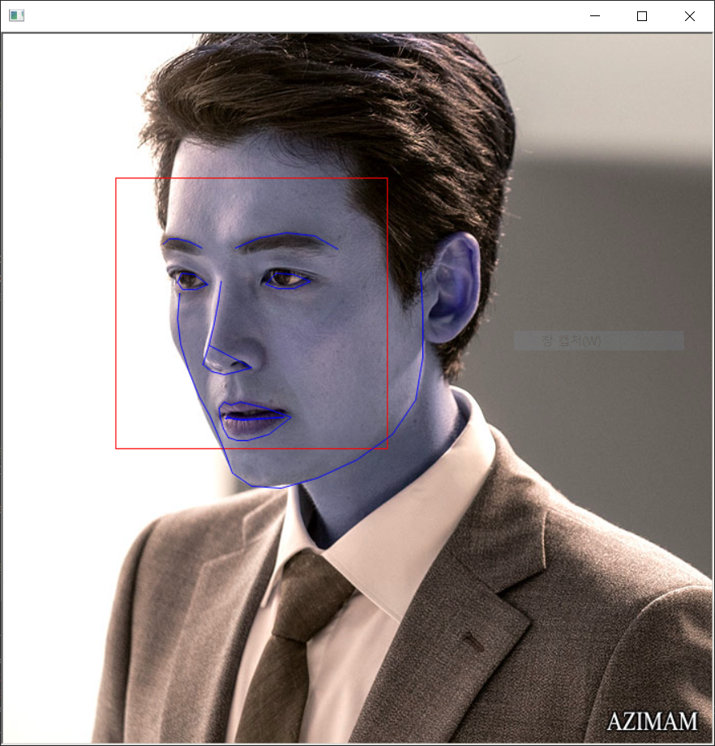

# AI Project sub3

## AI(CNN)을 활용한 엔터테인먼트 - 닮은꼴찾기

#### 목표 : CNN으로 학습한 데이터를 바탕으로 입력하는 input과 닮은꼴을 찾아주는 프로그램

#### web : Django(ver 3.0.3)

#### Dataset : Animal face data, 연예인 face data

<hr>

### sub3_model
1. 이미지로 부터 얼굴 인식
2. Face Landmark를 찾기
3. 눈,코,입이 중앙으로 오도록 이미지를 변형 
4. Face Encoding 후 CNN을 활용한 트레이닝


#### 현재까지 진행한 부분
- Face Landmark를 찾기
```
# 이미지에서 얼굴의 랜드마크 찾기
predictor_model = "./models/shape_predictor_68_face_landmarks.dat"

file_name = "./testimage/jung.png"

face_detector = dlib.get_frontal_face_detector()
face_pose_predictor = dlib.shape_predictor(predictor_model)

win = dlib.image_window()

image = cv2.imread(file_name)

detected_faces = face_detector(image, 1)

print("Found {} faces in the image file {}".format(
    len(detected_faces), file_name))

win.set_image(image)

for i, face_rect in enumerate(detected_faces):

    print("- Face #{} found at Left: {} Top: {} Right: {} Bottom: {}".format(i,
                                                                             face_rect.left(), face_rect.top(), face_rect.right(), face_rect.bottom()))

    win.add_overlay(face_rect)

    pose_landmarks = face_pose_predictor(image, face_rect)

    win.add_overlay(pose_landmarks)
``` 
#### result

