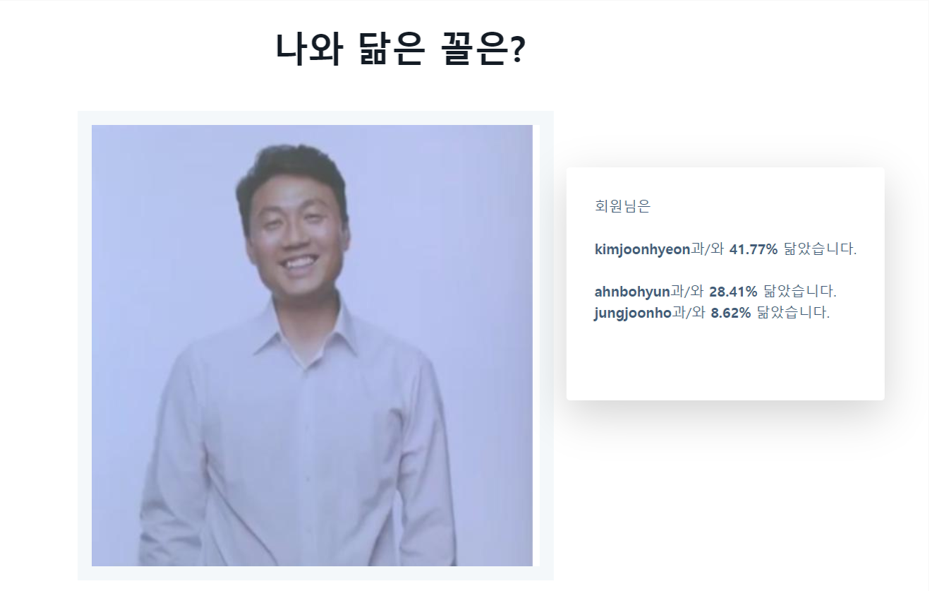
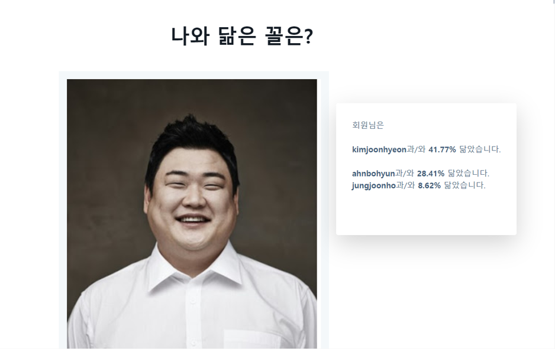

# AI Project sub3

# Title
- 너의 별명은
- AI(CNN)을 활용한 엔터테인먼트 - 닮은꼴찾기

# 📖 Contents
 * CNN으로 학습한 데이터를 바탕으로 입력하는 이미지와 닮은꼴을 찾아주는 프로그램

## 💻 DevTech

- Language : Python

- web : Django(ver 2.2.7)

- Dataset : Animal face data, 연예인 face data

## 💻 Developer
- 박석호(팀장)
- 김혜희
- 동명환
- 박성호
- 정수안
- 최현정

## sub3
### Data reprocessing
- Animal face data set 준비
- 연예인 face data set 준비
    - 배우 50명, 가수 50명 데이터 크롤링
- 얼굴인식
- crop
- resizing

### Model
- Inception V3 모델 수정
- retraining

### Web
- django framework 사용(MTV 패턴에 맞춘 개발)
- AWS 배포(EC2 내 서버 환경 구축 및 적용)
- https 적용(sslforfree 인증성 발급 및 nginx 연동으로 적용)
- Django Template 기반 프론트엔드 구성

#### result

